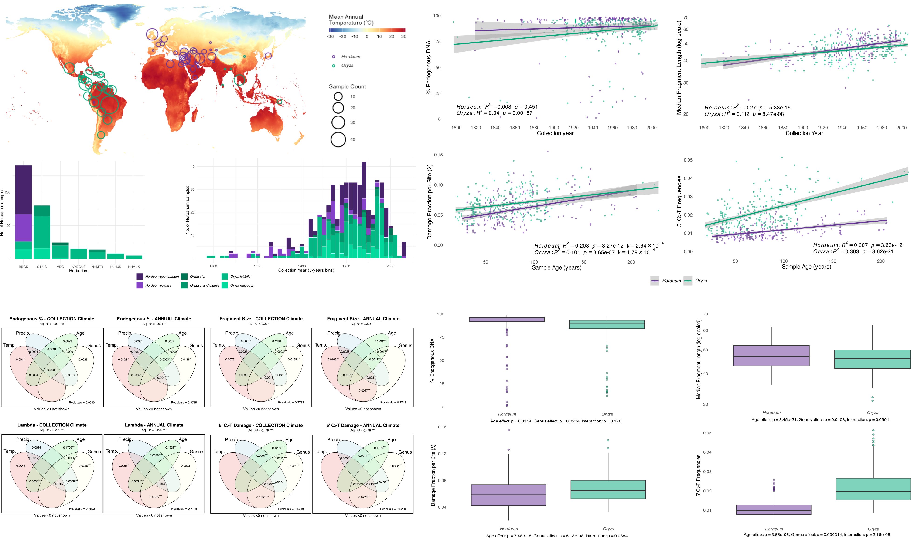

# Herbaria aDNA Damage

This repository contains a set of bash and R scripts to replicate the analyses and generate the figures in:

**Porrelli, S., Fornasiero, A., Le, P.H., Yin, W., Navarrete Rodrigues, M., Mohammed, N.,
Himmelbach, A., Clarke, A.C., Stein, N., Kersey, P.J., Wing, R.A., Gutaker, R.M. (2025)
Patterns of aDNA Damage Through Time end Environments – lessons from herbarium specimens**  
d.o.i.: [XXXXXXXXXXXXXXX](https://linktodoi.com)



## Overview

The workflow processes low-throughput (screening) sequencing data from 573 herbarium samples representing six plant species from two genera (*Hordeum* and *Oryza*) collected over a 220-year period (1797-2017) across the Americas and Eurasia.

Ancient DNA degrades over time through two primary mechanisms: cytosine deamination and depurination. Understanding these degradation patterns is crucial for optimizing aDNA research and informing museum curation practices. While previous studies have focused on archaeological samples with highly variable preservation conditions, herbarium specimens offer a unique opportunity to study DNA degradation under standardized storage conditions, allowing detection of subtle temporal patterns that are often masked in archaeological contexts.

The workflow consists of BASH and R scripts. The BASH scripts process raw sequencing data following the bioinformatics protocol described in [Latorre *et. al.*, 2020](https://doi.org/10.1002/cppb.20121) to calculate aDNA damage metrics. The R scripts then use these calculated damage metrics for downstream statistical analyses and visualization.

### RAW FASTQ DATA AVAILABILITY (SRA - NCBI):

Samples             | BioProject Link
------------------- | --------------------------
*Hordeum vulgare*   | [PRJNA1288534](https://example.com)
*Hordeum spontaneum*| [PRJNA1289164](https://example.com)
*Oryza rufipogon*   | [PRJNA1288425](https://example.com)
*Oryza grandiglumis*| [PRJNA1288424](https://example.com)
*Oryza latifolia*   | [PRJNA1288423](https://example.com)
*Oryza* Americas    | [PRJNA1302186](https://example.com)

## Plant aDNA Pipeline ([Latorre *et. al.*, 2020](https://currentprotocols.onlinelibrary.wiley.com/doi/10.1002/cppb.20121))

The repository includes two bash scripts for processing raw sequencing data and compute damage metrics before running the R analysis pipeline:

- `01_Plant_aDNA_screening_prep.sh`: Sets up the environment and installs required software for running [Plant_aDNA_pipeline](https://gitlab.com/smlatorreo/plant-adna-pipeline).
- `02_Plant_aDNA_screening_main.sh`: Main pipeline to calculate aDNA damage metrics.

The screening pipeline assesses library quality, sequencing run quality, DNA degradation magnitude, endogenous DNA percentage, and authenticates aDNA through quantification of nucleotide misincorporations

**Inputs**: Paired-end FASTQ files (*_1.fastq.gz and *_2.fastq.gz) in 1_initial_data/ directory

**Outputs**: Directory structure with:

- `2_trimmed_merged/` - Adapter-trimmed and merged reads
- `3_quality_control/` - FastQC reports
- `4_mapping/` - BAM files and mapping statistics
- `5_aDNA_characteristics/` - MapDamage2 outputs 
- `6_AMBER/` - Mapping bias assessment
- `7_preseq/` - Complexity curves and yield predictions

## R Statistical analyses workflow/scripts - REQUIREMENTS
Install the following R packages:

```text
packages <- c("dplyr", "tidyr", "purrr", "stringr", "readr",
              "MASS", "vegan", "car",
              "ggplot2", "colorspace", "viridis",
              "ggrepel", "ggtext", "ggpubr", "gridExtra", "cowplot",
              "sf", "geodata", "terra", "maps")
install.packages(packages)
```

### External Data
CHELSA V2.1 Climate Data: Download from https://chelsa-climate.org/

**Required bioclimatic variables:**

```text
CHELSA_bio1_1981-2010_V.2.1.tif (Annual mean temperature)
CHELSA_bio4_1981-2010_V.2.1.tif (Temperature seasonality)
CHELSA_bio12_1981-2010_V.2.1.tif (Annual precipitation)
CHELSA_bio15_1981-2010_V.2.1.tif (Precipitation seasonality)
```

**Required monthly data:**

```text
monthly/tas/CHELSA_tas_01_1981-2010_V.2.1.tif through CHELSA_tas_12_1981-2010_V.2.1.tif
monthly/pr/CHELSA_pr_01_1981-2010_V.2.1.tif through CHELSA_pr_12_1981-2010_V.2.1.tif
```

Place all files in chelsa_data/ directory.

**Reference Genomes:** Download from NCBI (see manuscript Table 2 for BioProject IDs)

## Script `aDNA_Dmg_Script00_collate_screening_results.r`

Collates aDNA damage metrics generated by `02_Plant_aDNA_screening_main.sh`, in addition to:

- Calculating the damage fraction per site (λ) by fitting exponential decay to fragment length distribution, as described in [Weiß *et. al.*, 2016](https://royalsocietypublishing.org/doi/10.1098/rsos.160239) and [Kistler *et. al.*, 2017](https://academic.oup.com/nar/article/45/11/6310/3806656)
- Analysing 5' C>T damage patterns by fitting exponential models to the first 20 bases.
- Generates QC plots showing lambda fits and damage decay curves.

**Input** files (generated by `02_Plant_aDNA_screening_main.sh`):

- `4_mapping/*.flagstat.log` - Mapping statistics
- `4_mapping/*.mapped.sorted.log` - Duplication rates
- `5_aDNA_characteristics/*/lgdistribution.txt` - Fragment length distributions
- `5_aDNA_characteristics/*/5pCtoT_freq.txt` - C>T substitution frequencies

**Outputs:**

- `aDNA_damage_screening_MAIN.txt` - Main results table with all calculated metrics
- `*_lambda_fit.pdf` - Individual plots showing fragment length decay and lambda calculation
- `*_dmg_decay.pdf` - Individual plots showing 5' C>T damage decay patterns

## Script `aDNA_Dmg_Script01_DataPrep.r`

Generates descriptive statistics and exploratory visualizations.

**input:**

- `aDNA_damage_screening_MAIN.txt`

**outputs:**

- Species distribution by herbarium (bar plots)
- Temporal distribution of samples (histograms)
- Geographic distribution maps
- Climate overlay maps (temperature and precipitation)

## Script `aDNA_Dmg_Script02_Regressions.r`

Examines relationships between aDNA damage metrics (endogenous fraction, fragment length, lambda, 5' C>T frequencies) and time using linear models.

**input:**

- `aDNA_damage_screening_MAIN.txt`

**outputs:**

- Endogenous fraction ~ Collection year
- Fragment length ~ Collection year
- Lambda (λ) ~ Sample age & DNA decay rates (*k*)
- 5' C>T damage ~ Sample age

## Script `aDNA_Dmg_Script03_fragment_size_subset.r`

Validates bioinformatic fragment size estimates using TapeStation data for a subset of the data (*N* = 40) using linear models.

**input:**

- `aDNA_damage_screening_SUBSET_TAPESTATION_gDNA.txt`

**outputs:**

- Library peak size ~ Median fragment size
- Library peak size ~ gDNA peak size
- gDNA peak size ~ Median fragment size
- gDNA peak size ~ Collection Year

## Script `aDNA_Dmg_Script04_Covariance.r`

Compares damage patterns between *Hordeum* and *Oryza* with analysis of covariance (ANCOVA) using sample age as covariate and genus as factor. Also tests for possible interactions between sample age and genus (i.e., differences in the slope of regression are dependent on genus).

**input:**

- `aDNA_damage_screening_MAIN.txt`

**outputs:**

- ANCOVA - Endogenous fraction
- ANCOVA - Fragment length
- ANCOVA - Lambda (λ)
- ANCOVA - 5' C>T damage

## Script `aDNA_Dmg_Script05a_CHELSA_ClimateData_varpart_MAIN.r`

Quantify unique and shared contributions of environmental factors to DNA damage (factors: Temperature, Precipitation, Age, Genus).

**inputs:**

- `aDNA_damage_screening_MAIN.txt`
- [CHELSA v.2.1 Climate data](https://chelsa-climate.org/)

**outputs:**

- VARPART - Endogenous fraction (Collection Climate / Annual Climate)
- VARPART - Fragment length (Collection Climate / Annual Climate)
- VARPART - Lambda (λ) (Collection Climate / Annual Climate)
- VARPART - 5' C>T damage (Collection Climate / Annual Climate)

## Script `aDNA_Dmg_Script05b_CHELSA_ClimateData_varpart_SUPPL.r`

Supplementary variance partitioning analyses including herbarium effects, and excluding genus:

- 3-way partitioning: Temperature, Precipitation, Age
- 4-way partitioning: Climate (merged), Age, Genus, Herbarium

**inputs:**

- `aDNA_damage_screening_MAIN.txt`
- [CHELSA v.2.1 Climate data](https://chelsa-climate.org/)

**outputs:**

- VARPART 3-way - Endogenous fraction (Collection Climate / Annual Climate)
- VARPART 3-way - Fragment length (Collection Climate / Annual Climate)
- VARPART 3-way - 5' C>T damage (Collection Climate / Annual Climate)
- VARPART 4-way - Endogenous fraction (Collection Climate / Annual Climate)
- VARPART 4-way - Fragment length (Collection Climate / Annual Climate)
- VARPART 4-way - 5' C>T damage (Collection Climate / Annual Climate)

## Script `aDNA_Dmg_Script06_Regression_5pDmg_Temp.r`

Examines the relationship between temperature and DNA deamination using linear models.

**input:**

- `aDNA_damage_screening_MAIN.txt`

**outputs:**

- 5' C>T damage ~ Annual mean temperature
- 5' C>T damage ~ Collection temperature
- Genus-specific temperature effects

## References

Allentoft, M.E., Collins, M., Harker, D., Haile, J., Oskam, C.L., Hale, M.L., Campos, P.F., Samaniego, J.A., Gilbert, M.T.P., Willerslev, E., Zhang, G., Scofield, R.P., Holdaway, R.N. and Bunce, M. (2012) 'The half-life of DNA in bone: measuring decay kinetics in 158 dated fossils', *Proceedings of the Royal Society B: Biological Sciences*, 279(1748) [10.1098/rspb.2012.1745](https://doi.org/10.1098/rspb.2012.1745)

Dolenz, S., van der Valk, T., Jin, C., Oppenheimer, J., Sharif, M.B., Orlando, L., Shapiro, B., Dalén, L. and Heintzman, P.D. (2024) 'Unravelling reference bias in ancient DNA datasets', *Bioinformatics*, 40(7) [10.1093/bioinformatics/btae436](https://doi.org/10.1093/bioinformatics/btae436)

Kistler, L., Ware, R., Smith, O., Collins, M. and Allaby, R.G. (2017) 'A new model for ancient DNA decay based on paleogenomic meta-analysis', *Nucleic Acids Research*, 45(11) [10.1093/nar/gkx361](https://doi.org/10.1093/nar/gkx361)

Latorre, S.M., Lang, P.L.M., Burbano, H.A. and Gutaker, R.M. (2020) 'Isolation, Library Preparation, and Bioinformatic Analysis of Historical and Ancient Plant DNA', *Current Protocols in Plant Biology*, 5(4) [10.1002/cppb.20121](https://doi.org/10.1002/cppb.20121)

Weiß, C.L., Schuenemann, V.J., Devos, J., Shirsekar, G., Reiter, E., Gould, B.A., Stinchcombe, J.R., Krause, J. and Burbano, H.A. (2016) 'Temporal patterns of damage and decay kinetics of DNA retrieved from plant herbarium specimens', *Royal Society Open Science*, 3(6) [10.1098/rsos.160239](https://doi.org/10.1098/rsos.160239)

## Citations

If you use the R code or data, please cite:

```text
Porrelli, S., Fornasiero, A., Le, P.H., Yin, W., Navarrete Rodrigues, M., Mohammed, N.,
Himmelbach, A., Clarke, A.C., Stein, N., Kersey, P.J., Wing, R.A., Gutaker, R.M. (2025)
Patterns of aDNA Damage Through Time end Environments – lessons from herbarium specimens XXXXXXXXXXXXXXX
```

If you use the BASH scripts (Plan_aDNA_pipeline), please cite:

```text
Latorre, S.M., Lang, P.L.M., Burbano, H.A. and Gutaker, R.M. (2020) 'Isolation, Library Preparation, and Bioinformatic Analysis of Historical and Ancient Plant DNA', *Current Protocols in Plant Biology*, 5(4) 10.1002/cppb.20121
```
